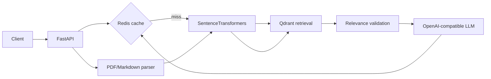

# Axentra RAG Service

Production-style RAG microservice for ingesting PDF and Markdown documentation, indexing it in Qdrant, and answering grounded questions through FastAPI.

## Architecture



## Docker Compose setup

From PowerShell at the repository root:

```powershell
Copy-Item .env.example .env
# Edit .env and set LLM_API_KEY and a calibrated RETRIEVAL_SCORE_THRESHOLD.
docker compose up --build
```

The API is available at `http://127.0.0.1:8000` and its OpenAPI UI at `http://127.0.0.1:8000/docs`.
The Streamlit workbench is available at `http://127.0.0.1:8501`.

Smoke test:

```powershell
Invoke-RestMethod http://127.0.0.1:8000/health
```

Stop services while preserving data volumes:

```powershell
docker compose down
```

## Local Python setup

```powershell
py -3.11 -m venv .venv
.\.venv\Scripts\Activate.ps1
python -m pip install --upgrade pip
python -m pip install -r Requirements.txt
python -m uvicorn app.main:app --reload
# In a second terminal:
python -m streamlit run Ui/streamlit.py
```

When running Streamlit directly on the host, set `RAG_API_URL=http://127.0.0.1:8000`. Docker Compose sets the container URL to `http://api:8000`.

For local execution, set `QDRANT_URL=http://localhost:6333` and `REDIS_URL=redis://localhost:6379/0` in `.env`.

## API examples

Upload documentation:

```powershell
curl.exe -X POST http://127.0.0.1:8000/documents -F "file=@docs/guide.md"
```

Ask a question:

```powershell
curl.exe -X POST http://127.0.0.1:8000/query `
	-H "Content-Type: application/json" `
	-d '{"question":"How do I authenticate?"}'
```

Delete a document:

```powershell
curl.exe -X DELETE http://127.0.0.1:8000/documents/<document_id>
```

## Tests

```powershell
.\.venv\Scripts\python.exe -m pytest tests -q
```

The OpenAPI UI is available at `http://127.0.0.1:8000/docs`.
